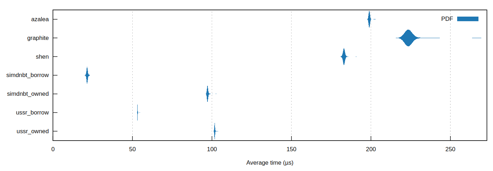
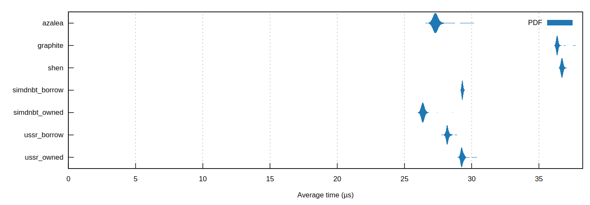

# ussr-nbt

A very fast and versatile NBT library for Minecraft: Java Edition.

Some features of this library:

-   A `borrow` module for avoiding most allocations and all copying.
-   An API that differentiates between full (`Nbt`) and partial (`Compound`, `Tag`, `List`) NBT values.
-   Support for `TAG_Long_Array` introduced in Minecraft 1.12.
-   Support for the modified UTF-8 encoding of strings that Java uses.

## Usage

```rust
use std::net::TcpStream;

use ussr_nbt::owned::*;

fn main() {
    let mut conn: TcpStream = TcpStream::connect("127.0.0.1:25565").unwrap();
    let nbt: Nbt = Nbt::read(&mut conn).unwrap();
    println!("{:#?}", nbt);
}
```

For more examples see the `examples` directory.

## Notes

-   Modified UTF-8 validation and conversion is not done during parsing.
-   Endianness is not swapped during parsing.
-   Bytes are unsigned.
-   When serializing, this library will only write up to [`i32::MAX`] elements for lists/arrays and up to [`u16::MAX`] bytes for strings. This is due to the fact that the NBT specification uses [`i32`] for lengths of lists/arrays and [`u16`] for lengths of strings.

## Roadmap

-   `nbt!` macro for constructing NBT values.
-   `serde` support.
-   Some macro for checking (and binding) NBT patterns.
-   SNBT formatting in `Debug`/`Display`.
-   Perhaps iterators for `RawVec` and `RawSlice`, although converting in bulk is more efficient.

## Performance comparison

Deserialization:

1. [`simdnbt::borrow`](https://crates.io/crates/simdnbt)
2. `ussr-nbt::borrow`
3. [`simdnbt::owned`](https://crates.io/crates/simdnbt)
4. `ussr-nbt::owned`
5. [`shen-nbt5`](https://crates.io/crates/shen-nbt5)
6. [`azalea-nbt`](https://crates.io/crates/azalea-nbt)
7. [`graphite_binary`](https://crates.io/crates/graphite_binary)



Serialization:

1. [`simdnbt::owned`](https://crates.io/crates/simdnbt)
2. [`azalea-nbt`](https://crates.io/crates/azalea-nbt)
3. `ussr-nbt::borrow`
4. `ussr-nbt::owned`\*
5. [`simdnbt::borrow`](https://crates.io/crates/simdnbt)\*
6. [`graphite_binary`](https://crates.io/crates/graphite_binary)
7. [`shen-nbt5`](https://crates.io/crates/shen-nbt5)

\*Note: numbers 4 and 5 are very close.



Plots are generated using [`criterion`](https://crates.io/crates/criterion).

## Cargo features

For swapping endianness in bulk this library uses SIMD instructions. By default, it will detect CPU features and use the fastest available instruction set. However, if you disable the `rt-cpu-feat` feature, it will always use the fallback implementation, which is actually the most performant implementation if compiled with `-C target-cpu=native`. Note that this flag will make the resulting binary not be able to run on CPUs other than the one it was compiled on.
